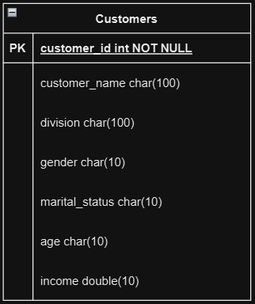

Clone the Repository in your system

\*\*\*Task 1

    1. Go to the Task_1/sales-barchart directory
    2. Run in your terminal " npm install " .
    3. For starting the project run " npm start ".
    4. I copied the Google Sheet you provided to another sheet because I used the data from the sheet directly in the project. To use it directly, it was necessary to publish the sheet, but since your sheet was private, it couldn't be published. My google sheet link = " https://docs.google.com/spreadsheets/d/18ZaafNumkqfNKLE0vFBHdSOyoTDrkpUIiEqUcc0kFOE/edit?usp=sharing "

\*\*\*Task 2

In this project i use django_restframework for backend and for frontend i use reactJS.

a. ER Diagram

    Backend
        1. Go to the Task_2/Backend/ directory.
        2. create a virtual environment. Open your terminal and run this command " python -m venv venv "
        3. Active the virtual environment " venv\scripts\activate ".
        4. Run " pip install -r requirements.txt " this command for install all the dependencies required for this project.
        5. Run this two command " pythone manage.py makemigration " " python manage.py migrate " .
        6. For starting the backend server run this code " pythone manage.py runserver " .
        7. Here i use the sqlite3 database for storing the data.
        7. For managing the backend here i use django built in admin dashboard. Admin dashboard link ="http://127.0.0.1:8000/admin" login username: maruf , Password: 12345

    Frontend
        1. Go to the Task_2\dashboard-frontend directory.
        2. Run in your terminal " npm install " .
        3. For starting the project run " npm start ".
